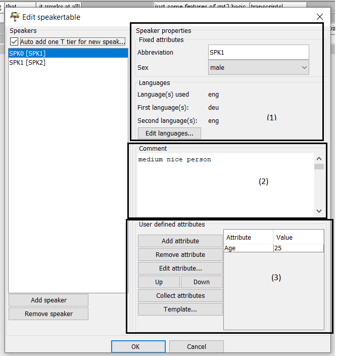

```{r, include = FALSE, echo=FALSE}
knitr::opts_chunk$set(
  collapse = TRUE,
  comment = "#>"
)
```

```{r setup, include=FALSE}
library(devtools)
#devtools::install_github("TimoSchuer/ExmaraldaR", force = TRUE)
library(ExmaraldaR)
library(knitr)

```

This package was developed to import transcripts of spoken language created with EXMARaLDA into R in a comfortable and fast way. First there will be some comments on how EXMARaLDA works and how transcription and annotation must be formatted to be easily readable. As I try to include more ways of transcribing and annotating data into this package, please write to me if your style does not work yet ([timo.schuermann\@uni-muenster.de](mailto:timo.schuermann@uni-muenster.de){.email}).

## Setup

For now the package is available via GitHub. This version is preliminary and will be upgraded whenever I find the time.

```{r eval= FALSE}
library(devtools)
devtools::install_github("TimoSchuer/ExmaraldaR",upgrade = "never", force = FALSE)
library(ExmaraldaR)
```

## Transcribing and annotating in EXMARaLDA

EXMARaLDA is a software package developed and maintained by Thomas Schmidt. Besides the transcription and annotation tool Partitur Editor, it includes a tool for managing corpora (Corpus-Manager) and a tool for searching and analyzing (EXAKT). This package only contains an interface between R and the .exb format of the Partitur Editor. Maybe there will be options for segmented files (.exs). Partitur Editor saves transcriptions as an xml-based data format, which makes it possible to extract all relevant information into a data table. As this is not be an extensive introduction to the EXMARaLDA-Software package I will in the following assume that the users of this package know:

1.  how to create a transcription
2.  how align audio/video data and transcription
3.  how to transcribe
4.  how to annotate a transcription (including aligning)

In the following I will consider some features of the work process that lead to a well-formed R- object. For that I will go backwards, showing you the output of example files and then the parameter in the Partitur Editor leading to this specific output.

```{r eval=FALSE}
path <- system.file("extdata", "Example_linear.exb", package = "ExmaraldaR", mustWork = TRUE)
read_exb_file(path, readAnn = TRUE, annotation= "linear", addMetaData = TRUE)
```

```{r echo=FALSE, results='asis', warning=FALSE}
path <- system.file("extdata", "Example_linear.exb", package = "ExmaraldaR", mustWork = TRUE)
example <- read_exb_file(path, readAnn = TRUE, annotation= "linear", addMetaData = TRUE)
kable(example)
```

This is the table from a an annotated exb. file using a linear annotation putting several information in just one tag (for more information see further below). So let's have a look at the different columns and the information they contain.

### IP Number

The first row contains an IP numbering based on the intonation phrase in GAT2. It uses the set of delimiters as the signs for intonation at the end of a phrase or the neutral "\|". If there are overlapping speech events, the one starting first gets the lower number.

### File

The name of the file. Important if more than one file (via read_exb_dir()) is imported.

### Speaker

Speaker single as named in the speaker table (see below).SINGLE?

### Tier ID

ID of each tier. Just important for files creating .exb files as add_min_tier() or write_back_to_exb()

### Name

Name of the speaker.

### Text

Transcription text divided into events as in the Partitur Editor.

### Metadata

Some additional information about the speaker added via the Speaker table. In this example file it is sex, languages used, L1, L2, comment and age.

### Start and End of event

Contains the start and the end in the timeline of an event. Only important for files creating .exb files as add_min_tier() or write_back_to_exb().

### Annotations

This is sorted version of the annotated data.

The data.frame contains all pieces of information that could be useful for further analysis. There is also some information that is only useful if, for example, you change something in the R data frame or excel file and want the data to be consistent with the exb files and therefore write it back. WRITE IT BACK?

In the next step we will look at the options in the speakertable that lead to the metadata columns.

## Metadata

 At some point of your transcription process you have to create speakers via the speakertable (Transcription \> Speakertable). In Section (1) there are fixed attributes. This includes speakerabbrevation (presented in the column 'speaker'), sex and languages. In section (2) you can make additional comments on the speaker. For most analytical purposes it can be useful to define some person-related information to include it into the analysis or subset your data to certain groups. The name attributes will be the name of the column. All information set here can be included or excluded from the data.frame with the parameter *addMetaData*.

## Linear annotation

With the (probably incorrect) term linear annotation I mean a format in which more than one piece of information is coded in one tag. This is useful for some tasks, especially in variable centered analysis, where more than one variable can occur in a transcription unit. I adopted this approach from Lanwer 2015 and his analysis of cooccurrence of phonological variants. Therefore it contains first the variable coded, then the variant and some contextual features. Of course it can also be used to code non-variable centered analysis. Formally every piece of information to be coded is structured as follows: ONGOING NUMBER OF CATEGORY:CATEGORY:SPECIFICATION . The first part is an ongoing number that is assigned to every category. This has to be consistent, because it is essential for sorting the category in the right column. The second part is the name of the category. This will also be the name of the column. The third part contains the specification of the category. The categories are separated by '\_' and the tag ends with ';', so that a tag could look like this: *1:Category1:Spec1_2:Category2: Spec2_5:Category5:Spec5;* .A tag coding a variable with context information would look like this: *1:VARIABLE:VARIABLENAME_2:VARIANT:VARIANTSPECIFICATION_3:CONTEXT1:SPECIFICATION;* A major improvement comparing to copying an EXACT result to an EXCEL file is that if a category is not specified there is no need to annotate it. The code will automatically sort it into the right column via the number. I highly recommend to use a self-defined (S.O.) annotation tag set (LINK EINFÜGEN).

```{r, eval= FALSE}
path <- system.file("extdata", "Example_linear.exb", package = "ExmaraldaR", mustWork = TRUE)
read_exb_file(path, readAnn = TRUE, annotation= "linear", addMetaData = TRUE)

```

## Multilayer annotation

{width="644"}

The probably more common annotation is a multi-layer annotation. This means that every annotation category has its own tier. This has some advantages but one major drawback is that the partitur editor can get very slow having many tiers and long recordings. On the other hand the annotation process is much faster and the revision process much easier. The annotation tiers in the example are speaker-related. This is not necessary as annotation tiers can also be without a speaker assignment. It has no influence on the output.

```{r, eval= FALSE}
path <- system.file("extdata", "Example_multi.exb", package = "ExmaraldaR", mustWork = TRUE)
read_exb_file(path, readAnn = TRUE, annotation= "multilayer", addMetaData = TRUE)
```

## Importing a directory

The given examples only import one file at a time. Often the data of interest is stored in different transcriptions. Therefore it is often useful to import them in once step and have the results in a single data.frame. This is possible with the function read_exb_dir(). For now it is only possible to import files with the same annotation style (multilayer **or** linear).

```{r, eval= FALSE}
path <- system.file("extdata\\read_dir", package = "ExmaraldaR", mustWork = TRUE)
read_exb_dir(path, addMetaData = TRUE, readAnn = TRUE, annotation = "linear")
```

## Write changes back to .exb files

Sometimes it can be useful to fix errors or merge or divide an annotation category because the analysis indicates that this could be useful. Of course it is possible to change it directly in the original file but this can be very inconvenient. A more direct way is to change it in the R data.frame or in an exported csv or EXCEL file. If done so it can be useful to write it back into an .exb file in order to keep the data consistent and keep the benefits of having annotation and audio aligned. There are two functions for achieving this: write_back_dir() writes back an entire directory of exb files. As input a data.frame or csv file created by read_exb_dir() is needed. write_back_to_exb() does the same for a single file needing a data.frame or csv-file created by read_exb_file().

```{r, eval= FALSE}
path <- system.file("extdata\\read_dir", package = "ExmaraldaR", mustWork = TRUE)
exb <- read_exb_dir(path, addMetaData = TRUE, readAnn = TRUE, annotation = "linear")
write_back_dir(exb, PathExbDir = path, PathNewFiles = path, suffix = "_new")
```

The same is possible for a single file.

```{r, eval= FALSE}
path <- system.file("extdata", "Example_linear.exb", package = "ExmaraldaR", mustWork = TRUE)
read_exb_file(path, readAnn = TRUE, annotation= "linear", addMetaData = TRUE)
write_back_to_exb(exb, PathExb = path, PathNewFile = path)
```

## **Add minimal tier to basic transcript (GAT2)**

It can be useful for searchability of the transcript to remove focus accents and other transcription conventions of the basic transcript. For this purpose the function add_MinimalTier adds a minimal tier to a transcribed file. The new file can be found in the origin folder and has the suffix "\_min".

```{r, eval= FALSE}
path <- system.file("extdata", "Example_linear.exb", package = "ExmaraldaR", mustWork = TRUE)
add_MinimalTier(path)
```


## Merge files

It can be useful to merge files. E.g. if you distribute snippets to students. merge_exb_file() coalesces several files. This does the same as Transcription \> Merge transcriptions just with multiple files at a time. Therefore you provide a list of file e.g. via rChoiceDialogs::rchoose.files()

```{r, eval= FALSE}
files <- rChoiceDialogs::rchoose.files()
mergedFile <- merge_exb_files(files)
dir <- dirname(files[1]) # choose directory of the imported files
filename <- "merged_file.exb" # filename
path <- paste(dir, filename, sep= "/")
xml2::write_xml(mergedFile, path)
```
